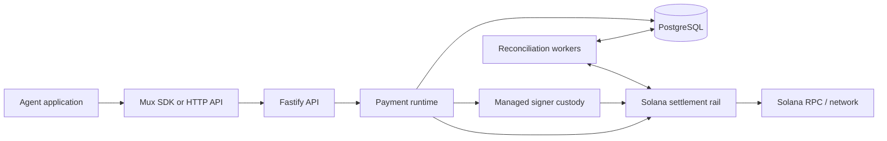

# Mux

Mux is a custodial payment runtime that gives AI-agent applications programmable accounts and normalized payment operations while keeping Solana transaction mechanics inside the backend.

## Problem

Giving an agent a raw blockchain wallet also gives it responsibility for RPC calls, token accounts, mint decimals, transaction construction, signing, retries, confirmation, and reconciliation. Those concerns make ordinary tasks such as checking a balance or paying a known recipient chain-specific and difficult to recover safely.

## Solution

Mux exposes an account-oriented model: balances, recipients, `pay`, `send`, `receive`, refunds, payment status, and transaction history. The backend owns the managed signer, persists the payment lifecycle, reserves outgoing funds, submits settlement transactions, and reconciles ambiguous or incoming activity.

## Why Solana

Solana is the settlement rail in the current implementation, not a detail the agent must operate directly. Every Agent Account has a real Solana signer, and confirmed payments correspond to classic SPL Token transfers of one configured mint. Mux constructs and signs those transactions, pays network fees from a separate platform fee payer, and ties confirmation and reconciliation to on-chain transaction state.

The v1 custody boundary is intentionally narrow:

- account signers are managed by the backend;
- signer secrets are encrypted with `WALLET_MASTER_KEY`, but this prototype does not use an HSM or MPC;
- one classic SPL settlement mint is configured for the runtime;
- the public `USD` contract is a normalized accounting interface, not fiat custody, an FX service, or a claim that every configured mint is redeemable for dollars.

## Features

- Agent Account creation with one-time API credentials, hashed credential storage, rotation, and revocation
- Encrypted per-account Solana signer custody and a separate platform fee payer
- Settled, pending-outgoing, and available balance reads
- Account-owned recipients for external or managed Solana destinations
- Idempotent `pay`, `send`, and managed-account refund operations
- Durable reservations, attempts, confirmation, recovery, and reconciliation
- Persistent receive requests and discovery of incoming SPL transfers
- Payment lookup plus cursor-paginated payment and transaction history
- TypeScript SDK for the agent-facing account operations
- Automated local PostgreSQL, Solana validator, fee payer, and test-mint setup
- Explicit mainnet opt-in and runtime network/mint validation

## Architecture



See [Architecture](docs/architecture.md) for component boundaries, payment states, custody, and reconciliation.

## Quick Start

Requirements: Node.js 22+, pnpm 11+, Docker with Compose, the Solana CLI (including `solana-keygen` and `solana-test-validator`), and `spl-token`.

From the repository root:

```bash
pnpm install --frozen-lockfile
pnpm local:setup
pnpm dev
```

In another terminal:

```bash
curl http://127.0.0.1:3000/ready
pnpm local:status
```

Expected readiness response:

```json
{"status":"ok"}
```

`local:setup` creates a local-only environment: PostgreSQL, a detached Solana validator, a platform fee payer funded with fake SOL, a 6-decimal classic SPL test mint, generated API and wallet-encryption secrets, a root `.env`, and the committed database migrations. It does not use mainnet, real money, or an external faucet.

Stop project-owned local infrastructure without deleting the database volume, ledger, keypairs, or `.env`:

```bash
pnpm local:down
```

Running `pnpm local:setup` again preserves existing local secrets and state.

## Basic Usage

Create an Agent Account with the admin API. The generated `.env` is loaded automatically by project commands, but shell variables are not modified. Load only the admin key before the manual request.

Bash or zsh:

```bash
export ADMIN_API_KEY="$(node scripts/run-with-root-env.mjs --require=ADMIN_API_KEY node -e 'process.stdout.write(process.env.ADMIN_API_KEY ?? "")')"
```

Fish:

```fish
set -gx ADMIN_API_KEY (node scripts/run-with-root-env.mjs --require=ADMIN_API_KEY node -e 'process.stdout.write(process.env.ADMIN_API_KEY ?? "")')
```

Then create the account:

```bash
curl -X POST http://127.0.0.1:3000/v1/accounts \
  -H "x-admin-api-key: $ADMIN_API_KEY" \
  -H 'content-type: application/json' \
  -d '{"name":"research-agent"}'
```

The response contains an `api_key` shown once. Use it with the workspace SDK:

```ts
import { AgentPaymentAccount } from '@agent-payment/sdk'

const account = new AgentPaymentAccount({
  baseUrl: 'http://127.0.0.1:3000',
  apiKey: process.env.AGENT_API_KEY!,
})

const balance = await account.getBalance()
const payment = await account.pay(
  {
    recipientId: 'rcpt_...',
    amount: '0.50',
    description: 'dataset access',
  },
  { idempotencyKey: 'order-123-payment' },
)
```

An HTTP `200` or `201` is not proof of blockchain confirmation. Treat only a payment with `status: "CONFIRMED"` as confirmed; poll `getPayment()` when a result remains `RECONCILING`.

## Local Development

Root project commands load the checkout's root `.env` explicitly, even when pnpm runs tooling from a workspace directory. Root `.env` values for project configuration take precedence over stale shell values; system variables such as `PATH`, `HOME`, and temporary-directory settings are preserved.

Useful commands:

| Command | Purpose |
| --- | --- |
| `pnpm local:setup` | Create or restart the preserved local environment and deploy committed migrations |
| `pnpm local:status` | Report PostgreSQL, Solana, mint, fee-payer, and API status without printing secrets |
| `pnpm local:down` | Stop only this checkout's local infrastructure while preserving state |
| `pnpm db:migrate` | Author a new Prisma migration during schema development |
| `pnpm db:migrate:deploy` | Apply already committed migrations |

### Configuration

See [`.env.example`](.env.example) for safe manual defaults and accepted secret formats.

| Variable | Purpose |
| --- | --- |
| `DATABASE_URL` | PostgreSQL connection URL |
| `PORT` | API port; defaults to `3000` |
| `NODE_ENV` | `development`, `test`, or `production` |
| `ADMIN_API_KEY` | Administrative account and credential authentication |
| `SOLANA_RPC_URL` | RPC endpoint for the configured cluster |
| `SOLANA_CLUSTER` | `localnet`, `devnet`, `testnet`, or `mainnet-beta` |
| `SOLANA_SETTLEMENT_MINT` | One classic SPL mint used for settlement |
| `SOLANA_FEE_PAYER_SECRET` | Separate platform fee-payer signer secret |
| `WALLET_MASTER_KEY` | 32-byte key used to encrypt managed signer secrets |
| `ALLOW_MAINNET` | Additional explicit mainnet opt-in; defaults to `false` |

For a custom RPC, devnet, or testnet, create `.env` from `.env.example` and supply a mint and funded fee payer belonging to that cluster. Do not use `local:setup` to prepare a custom network. Mainnet is never part of Quick Start and requires both `SOLANA_CLUSTER=mainnet-beta` and `ALLOW_MAINNET=true`.

## Documentation

- [Product](docs/product.md) — users, mental model, product flow, v1 scope, and non-goals
- [Architecture](docs/architecture.md) — components, lifecycle, custody, data, and trust boundaries
- [API Reference](docs/api.md) — authentication, routes, payloads, statuses, and errors
- [Roadmap](docs/roadmap.md) — implemented scope and explicitly uncommitted future directions
- [Contributing](CONTRIBUTING.md) — development and pull-request workflow

## Current Scope and Limitations

- The runtime is custodial and stores encrypted signer material in PostgreSQL.
- Only `USD` is exposed and only one configured classic SPL mint settles it.
- Refunds are supported only when the original recipient is another managed account and the reverse destination is known.
- External recipient token accounts must already exist; sponsored associated-token-account creation is limited to verified managed recipients.
- Cards, bank rails, x402, FX, off-ramp, KYC, a browser UI, and agent orchestration are not part of v1.
- This repository does not claim HSM/MPC custody or an external security audit.

## Roadmap

The implemented v1 and possible post-v1 directions are separated in [Roadmap](docs/roadmap.md). No dates or post-v1 commitments are declared in the repository.

## Contributing

See [CONTRIBUTING.md](CONTRIBUTING.md) before opening a change.
