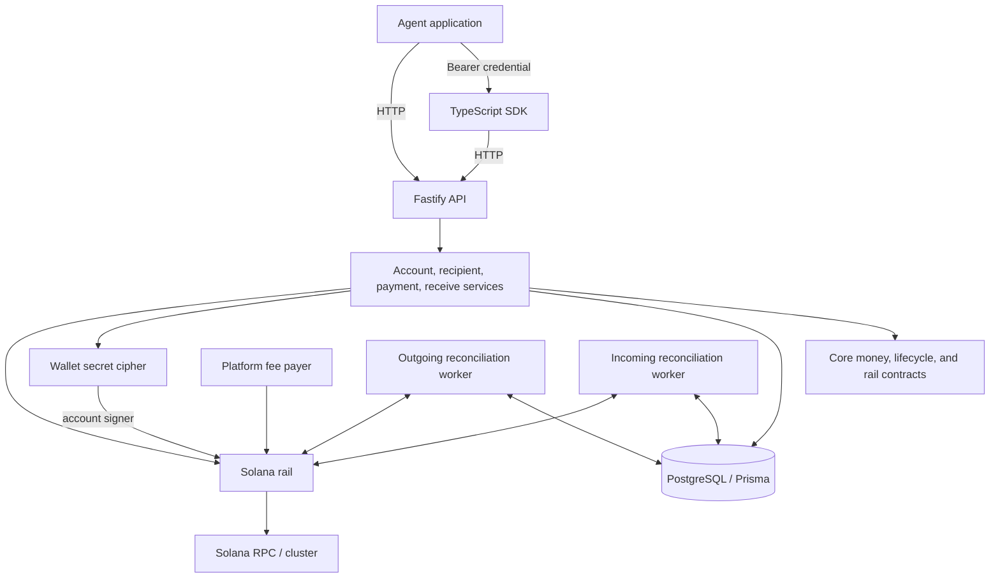
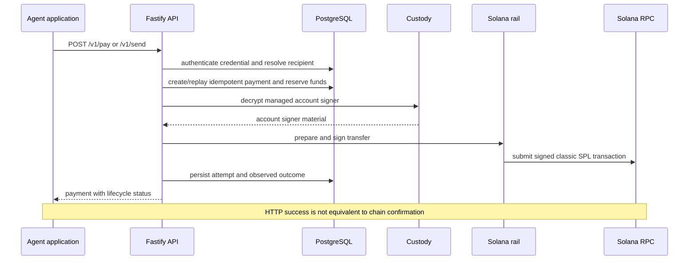
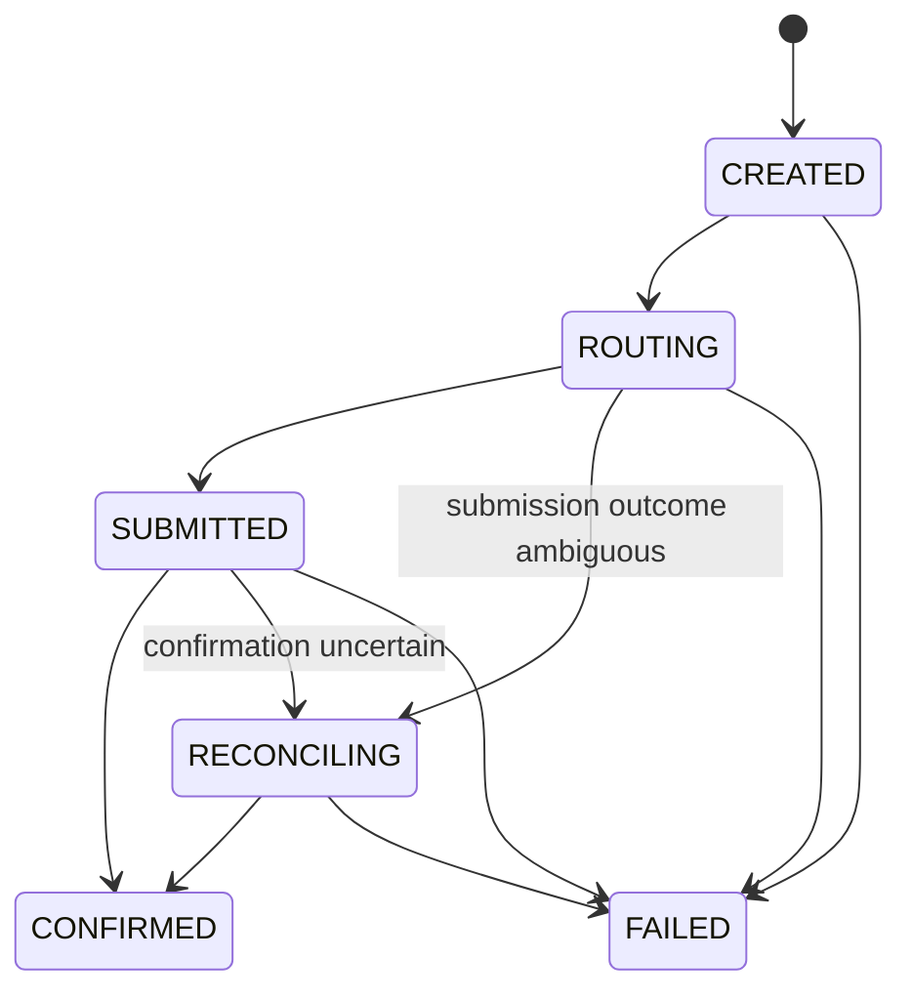

# Architecture

## System Overview

Mux is a pnpm TypeScript workspace built around a Fastify API, a PostgreSQL state store, and a classic SPL Token settlement rail. The API presents normalized financial operations; the Solana adapter owns chain-specific reads and writes; background reconciliation closes the gap between durable runtime intent and on-chain outcomes.

## Components

### Fastify API — `apps/api`

The API authenticates administrators and Agent Accounts, validates HTTP input, and coordinates account, recipient, balance, payment, receive, and transaction services. It returns wire-format JSON from the shared contracts and adds an `x-request-id` response header.

The server also starts periodic outgoing and incoming reconciliation work. HTTP handlers do not redefine the rail or database contracts.

### Core — `packages/core`

Core defines normalized money, identifiers, payment states, routing and rail interfaces, and domain errors. It is the boundary between account-oriented payment intent and a settlement implementation.

### Contracts — `packages/contracts`

Shared Zod schemas define the agent-facing request and response shapes consumed by the API and SDK. Public money values are fixed two-decimal `USD` strings.

### Database — `packages/db`

Prisma repositories persist accounts, credential hashes, recipient configuration, payments, attempts, idempotency records, reservations, receive requests, incoming transfers, reconciliation issues and cursors, fee sponsorship, and runtime metadata in PostgreSQL.

PostgreSQL is the source of truth for off-chain intent and workflow state. It is not the source of truth for an SPL token balance or final transaction result.

### Solana rail — `packages/solana-rail`

The rail reads balances and mint metadata, derives associated token accounts, builds classic SPL `transferChecked` transactions, signs them, submits them, checks confirmation, and scans incoming activity. It validates the configured network and rejects a settlement mint that is not owned by the classic SPL Token program.

### TypeScript SDK — `packages/sdk`

`AgentPaymentAccount` wraps the bearer-authenticated agent routes, maps snake_case wire objects to TypeScript objects, supplies timeouts and retries, and generates an idempotency key when a money operation does not receive one. Polling payment status remains an explicit caller action.

## Outgoing Request Flow

The idempotency key is bound to the logical request. Reusing a key with a different request produces a conflict; replaying the same request returns the existing payment.

## Payment Lifecycle

- `CREATED`: durable payment intent exists.
- `ROUTING`: recipient and rail execution are being resolved or prepared.
- `SUBMITTED`: a transaction was submitted and is awaiting a final result.
- `RECONCILING`: the runtime cannot yet prove success or failure and must inspect the durable attempt and chain state.
- `CONFIRMED`: the configured confirmation check observed the expected transaction outcome.
- `FAILED`: a deterministic or reconciled failure was recorded.

An outgoing reservation reduces `available` balance while a payment can still consume funds. Ambiguous attempts retain their reservation and signed payload metadata so recovery does not create an unsafe replacement transaction.

## Custody Boundary

Each Agent Account receives a generated Solana signer. The public key is stored with the account. Its 64-byte secret is encrypted with AES-256-GCM before persistence; ciphertext, nonce, and authentication tag are stored in PostgreSQL. `WALLET_MASTER_KEY` supplies the 32-byte encryption key at runtime.

The backend decrypts account signer material only when it needs to sign a settlement transaction and clears mutable secret buffers where the implementation can do so. This is application-level encrypted custody, not non-custodial operation, HSM isolation, or MPC.

The platform fee payer is a different signer supplied through `SOLANA_FEE_PAYER_SECRET`. It pays network transaction fees and, for verified managed recipients, may sponsor associated-token-account creation within configured runtime limits. It does not replace the Agent Account as the transfer authority.

## Data and State Boundaries

| State | Location | Meaning |
| --- | --- | --- |
| Account identity and Solana public key | PostgreSQL | Off-chain account ownership and managed signer address |
| Agent credential | Application receives plaintext once; PostgreSQL stores hash and prefix | Bearer authentication, rotation, and revocation |
| Encrypted account signer | PostgreSQL | Custodial signing material protected by `WALLET_MASTER_KEY` |
| Payment intent, attempts, idempotency, reservations | PostgreSQL | Durable workflow and recovery state |
| Receive requests and reconciliation cursors | PostgreSQL | Expected incoming activity and scanner progress |
| SPL token balances and transaction result | Solana | Settlement state observed through the configured RPC |
| Platform fee-payer secret | Process environment | Network fee authority; not stored through the account repository |

Runtime metadata pins the configured rail version, cluster, settlement mint, and custody-key fingerprint. Startup validation prevents silently opening existing custody state with incompatible runtime configuration.

## Solana Settlement Rail

The runtime exposes `USD` with two decimal places. The rail reads the configured mint's decimals and converts normalized amounts to mint atomic units before using `transferChecked`. Only the classic SPL Token program is accepted; Token-2022 is not the v1 settlement rail.

An external recipient's `wallet_address` identifies its Solana owner/public key. Mux derives the associated token account for that owner and the configured settlement mint; the derived account must already exist because Mux does not sponsor token-account creation for arbitrary external recipients. A recipient tied to another managed account is checked against that account's canonical public key and may receive sponsored associated-token-account creation through the platform fee payer.

The platform fee payer and settlement mint are global runtime configuration. Agent Account balances remain held at account-owned SPL token accounts and transfers are authorized by the corresponding account signer.

## Incoming Reconciliation

Receive requests persist an account destination, reference, optional amount, and optional expiration. The incoming worker scans confirmed Solana activity, validates successful transfers for the configured mint, records incoming payments, advances an indexer checkpoint, and associates matching references with open receive requests.

Confirmed incoming transfers appear in normalized transaction history with direction `INCOMING` and kind `RECEIVE`. PostgreSQL records discovery and matching state; the token transfer itself remains on-chain.

## Recovery and Idempotency

Money-changing routes require an `idempotency-key`. Mux stores both the key and a fingerprint of the request so a safe replay returns the original payment while conflicting reuse fails.

Before submission, the runtime persists payment and attempt state. If transport or RPC behavior makes the outcome uncertain, the payment moves to `RECONCILING`. The outgoing worker checks the expected signature and durable attempt rather than assuming failure or generating a replacement transfer. Reservations are released only when the lifecycle reaches an outcome that permits release.

## Trust and Security Boundaries

- Administrators know `ADMIN_API_KEY` and can create accounts, inspect non-secret credential metadata, issue credentials, and revoke them.
- An agent application knows only its one-time bearer credential and the normalized API surface. It never receives the managed signer secret.
- The API process can access the database, `WALLET_MASTER_KEY`, the platform fee-payer secret, and decrypted account secrets while signing. Compromise of this boundary is a custody compromise.
- PostgreSQL stores sensitive encrypted signer material plus all off-chain financial workflow state. Database access alone does not provide the wallet master key, but database integrity is required for safe orchestration.
- The configured Solana cluster is the final settlement system. RPC responses are checked against the configured cluster and mint, but the operator chooses the RPC provider.
- Mainnet is disabled unless both `SOLANA_CLUSTER=mainnet-beta` and `ALLOW_MAINNET=true` are present.

## Local Development Architecture

`pnpm local:setup` creates preserved state under `.local/`, starts the Compose PostgreSQL service, starts a detached `solana-test-validator` with a checkout-specific ledger, creates local fee-payer and mint keypairs, funds the fee payer with validator-only SOL, initializes a 6-decimal classic SPL mint, writes safe local configuration to the root `.env`, and applies committed migrations through `db:migrate:deploy`.

The generated `.env`, keypairs, and ledger are gitignored. `pnpm local:down` stops only project-owned infrastructure and preserves those files and the PostgreSQL volume. See the [README Quick Start](../README.md#quick-start) for the operator workflow.
