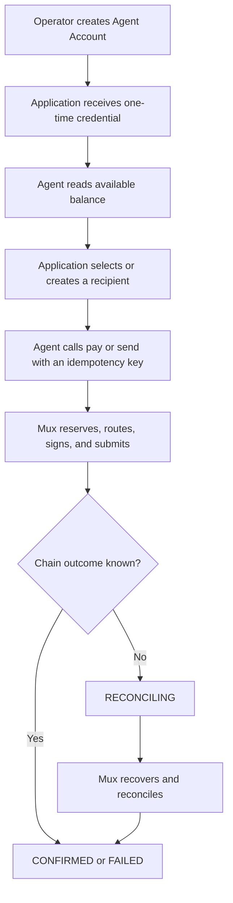

# Product

## What Is Mux?

Mux is a backend financial runtime for developers building AI-agent applications. It gives each agent-facing integration a persistent custodial account and a small set of normalized payment operations while the backend handles Solana settlement details.

The product is an API and TypeScript SDK, not an autonomous agent or a user interface.

## Target Users

Mux is designed for developers who need an application or agent to:

- hold and read a balance in one configured settlement asset;
- identify approved recipients before moving funds;
- initiate payments with recoverable, idempotent requests;
- publish receive instructions;
- inspect payment state and transaction history without parsing the chain directly.

Operators administer Agent Accounts and credentials, configure the settlement mint and network, and control the backend custody secrets.

## Problem

A raw blockchain wallet exposes a large operational surface to an agent: RPC selection, token-account derivation, mint precision, instruction construction, signing, fee payment, submission retries, confirmation, and uncertain outcomes. The application must also keep its own intent and balance view consistent with chain state.

Mux moves those responsibilities behind an account-oriented contract. The agent uses amounts such as `"0.50"` in `USD`, recipient IDs, idempotency keys, and normalized lifecycle states; the runtime translates that intent into a real SPL transfer and records how it progresses.

## Product Model

### Agent Account

An Agent Account is the authenticated owner of balances, recipients, payments, receive requests, and transaction history. It has a managed Solana signer. The account receives an API credential once when the account or credential is created; only its hash and non-secret prefix are retained for later authentication and administration.

### Balance

The balance response separates:

- `settled`: tokens currently observed on-chain;
- `pending_outgoing`: funds held by active outgoing reservations;
- `available`: settled funds not reserved by in-flight payments.

All public amounts use fixed two-decimal `USD` strings. The configured settlement mint remains an operator concern.

### Recipient

A recipient is an account-owned payment target. A payment request references `recipient_id` rather than accepting an arbitrary wallet address. Recipients can point to an external Solana destination or to another Agent Account whose canonical public key is checked by the server.

### Payment

`pay` and `send` create outgoing payment records through the same execution and recovery pipeline. A refund creates a new reverse payment; it does not cancel an immutable transaction. Payment state is explicit and may remain reconciling while the final chain outcome is unknown.

### Receive Request

A receive request publishes the account's SPL destination together with an optional amount, caller-supplied reference, and expiration. Incoming reconciliation discovers confirmed transfers and associates references when possible. Creating a receive request does not itself move funds.

### Transaction History

Transaction history combines outgoing payments and discovered incoming transfers into one normalized, cursor-paginated view.

## Typical Flow

The application must inspect the payment status. Successful HTTP delivery means the API accepted or replayed the operation; it does not by itself prove on-chain confirmation.

## What Mux Abstracts Away

For agent-facing operations, Mux owns:

- classic SPL token-account and transfer construction;
- conversion between normalized money and mint atomic units;
- account signing and separate platform fee payment;
- durable idempotency records and outgoing reservations;
- transaction submission, confirmation polling, and ambiguous-outcome recovery;
- incoming transfer discovery and receive-request matching.

Operators still choose and fund the network, RPC, settlement mint, and platform fee payer. They also control the database and wallet master key.

## Current v1 Scope

Implemented v1 includes:

- administratively created Agent Accounts and revocable credentials;
- one normalized currency, `USD`;
- one configured classic SPL settlement mint;
- localnet, devnet, testnet, and explicitly enabled mainnet-beta configuration;
- balances, recipients, `pay`, `send`, managed-account refunds, receive requests, payment lookup, and transaction history;
- a custodial backend signer per account and a separate platform fee payer;
- PostgreSQL persistence for runtime intent, attempts, reservations, and reconciliation state;
- an agent-facing TypeScript SDK;
- an automated local development environment.

## Non-Goals

The current product does not provide:

- non-custodial wallet control, HSM custody, or MPC;
- multiple currencies, mint routing, fiat custody, or foreign exchange;
- cards, bank transfers, x402, off-ramp, or KYC workflows;
- a browser UI, operator dashboard, or autonomous-agent orchestration;
- arbitrary refunds to uncontrolled external destinations;
- a claim that the prototype is externally audited or production-ready.

See [Architecture](architecture.md) for technical boundaries and [Roadmap](roadmap.md) for the distinction between current functionality and possible future work.
